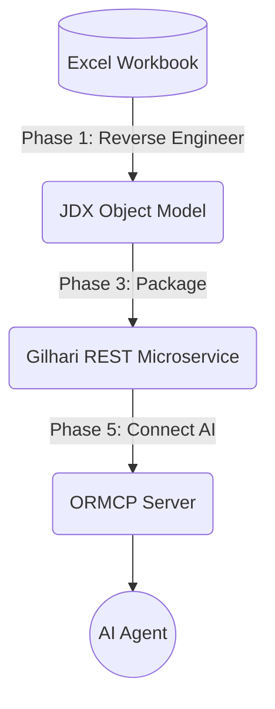

# Excel ORM Skyway PoC

Software Tree's ORM Skyway automation tool connects your existing data sources to AI agents — automatically. Point it at your data, and within minutes you have a secure, governed API layer that lets AI reason about your business objects: customers, orders, products, employees — whatever your domain holds.

You can immediately start leveraging your data for AI applications through a secure and efficient ORM pipeline.

This project is a Proof of Concept (PoC) validating Software Tree's [ORM Skyway](https://github.com/SoftwareTree/orm_skyway_automation) pipeline against **Microsoft Excel**. It demonstrates data access and AI-agent integration for Excel using JDX, Gilhari, and ORMCP.

## Core Technologies

- **JDX**: A lightweight, non-intrusive Java ORM engine that reverse-engineers relational schemas into a curated Java/JSON object model—the foundational data-access layer beneath Gilhari.
- **Gilhari**: A RESTful microservice framework, built on JDX, that exposes your database as a governed, object-oriented REST API with no hand-written server code.
- **ORMCP**: An MCP-compliant semantic layer that bridges AI agents to your database through Gilhari. It exposes enterprise data as curated business objects (rather than raw SQL), improving reasoning clarity, reducing token usage, and introducing a cleaner governance boundary.

## Project Overview

**The pipeline workflow:**



This reflects the ORM Skyway automated workflow layers:
```text
ORMCP Pipeline   ─────────────────────────────────  ← AI / MCP layer
                              ↑
Gilhari Pipeline ─────────────────────────────────  ← REST microservice layer
                              ↑
JDX Pipeline     ─────────────────────────────────  ← Java/JSON ORM layer
                              ↑
Excel Data       ═════════════════════════════════  ← foundation
```
This project successfully proves that Excel (via the CData JDBC driver) supports:
- Data access via REST
- Live natural-language querying via AI agents connected through MCP.

### Object Model Description

The object model derived by the `orm_skyway` tool is dynamically mapped to the Excel dataset. Because Excel data is often semi-structured compared to a strict relational database, the generated Java object model (e.g., `com.poc.excel.model.Customers`) extends `JDX_JSONObject`. This allows it to gracefully handle records from the Excel spreadsheet as JSON objects, providing a flexible representation of the data that Gilhari can seamlessly expose over REST.

## Project Structure

This project uses the following file structure:
```text
excel_poc/
├── .dockerignore
├── .git/
├── .gitattributes                
├── .gitignore                    
├── bin/                          # Compiled Java classes
├── config/                       # Driver jars, generated reverse engineering configs, and data file
├── customers.xlsx                # Sample Excel data file
├── gilhari/                      # Generated Gilhari configuration, Dockerfile, and curl scripts
├── LICENSE                       # Project license
├── orm_skyway_config_excel.json  # Pipeline configuration (gitignored)
├── README.md                     # This file
├── scripts/                      # Helper scripts
├── sources.txt                   # Java source files compilation list (gitignored)
└── src/                          # Generated Java object model source files
```

## Prerequisites & Environment Setup

- **Java & Python**: JDK 8+ and Python 3.8+
- **Gilhari SDK**: Required for JDX ORM libraries.
- **Excel JDBC Driver**: CData JDBC Driver for Excel. Place `cdata.jdbc.excel.jar` and your `.xlsx` data file in the correct paths.
- **Docker**: For running the Gilhari REST microservice.

### Configuring the Project

For security and portability, paths are configured via a JSON file. 

1. **Pipeline Configuration (`orm_skyway_config_excel.json`)**
   Create or edit `orm_skyway_config_excel.json` in the root directory (this file is gitignored). You must set up the local paths for the JDX SDK, JDBC driver, and Excel workbook. A standard setup looks like this:
   ```json
   {
       "_comments": [
           "ORM Skyway config for Excel via the CData JDBC Driver for Excel."
       ],
       "jdbc_url": "jdbc:excel:URI=./customers.xlsx",
       "db_schema": "",
       "db_user": "",
       "db_password": "",
       "jdbc_driver_jar": "/path/to/cdata.jdbc.excel.jar",
       "jdbc_driver_class": "cdata.jdbc.excel.ExcelDriver",
       "db_type": "",
       "jx_home": "/path/to/Gilhari-0.8.0b-SDK",
       "object_model_package": "com.poc.excel.model",
       "reverse_eng_template_config": "reverse_eng_template",
       "tables": "all",
       "model_overview": "Excel workbook exposed as an object model (Excel + CData proof of concept)",
       "embed_db_file_in_microservice": false,
       "docker_image_name": "excel-poc-service",
       "docker_image_tag": "1.0",
       "gilhari_host_port": 80,
       "skip_reverse_eng": false,
       "skip_compile": false,
       "verbose": true,
       "docker_hostname": "generic-laptop",
       "docker_mac_address": "00-00-00-00-00-00"
   }
   ```

## Running the Pipeline

1. **Reverse Engineer & Build (Phases 1 & 3)**
   Run the ORM Skyway automation script pointing to the JSON config in this repository:
   ```bash
   python /path/to/orm_skyway_automation/orm_skyway.py -f orm_skyway_config_excel.json --phase 1+3
   ```

2. **Start the Microservice (Phase 4)**
   Run the generated Docker container script:
   ```bash
   # Windows
   gilhari\run_docker_app.cmd
   
   # Linux/macOS
   ./gilhari/run_docker_app.sh
   ```
   The service will be exposed on port 80.

3. **Verify REST API**
   You can verify the Gilhari REST endpoints using `curl.exe`:
   ```bash
   curl.exe -s http://localhost:80/gilhari/v1/health/check
   ```

4. **Connect AI Agent via ORMCP (Phase 5)**
   Use ORMCP to expose the REST API to Claude Desktop or Antigravity IDE. Add the following to your MCP server config:
   ```json
   "excel-ormcp": {
       "command": "ormcp-server",
        "args": [],
        "env": {
            "GILHARI_BASE_URL": "http://localhost:80/gilhari/v1/",
            "MCP_SERVER_NAME": "excel-ormcp",
            "GILHARI_NAME": "excel-poc-service",
            "GILHARI_IMAGE": "excel-poc-service:1.0",
            "GILHARI_PORT": "80",
            "READONLY_MODE": "True"
        }
    }
    ```

   Once connected, you can ask the AI Agent natural language queries such as:
   - *"Show me the first 5 customers in the database."*
   - *"How many customers are located in New York?"*
   - *"Retrieve the contact details for the customer named John Doe."*

## Repository Metadata

*The following can be used to update your GitHub repository settings:*

**Description:**
A Proof of Concept demonstrating the ORM Skyway pipeline to expose Microsoft Excel data as a REST microservice for AI Agents using JDX and Gilhari.

**Topics:**
`excel`, `orm-skyway`, `ai-agent`, `mcp`, `java`, `gilhari`, `jdx`, `rest-api`, `cdata`
